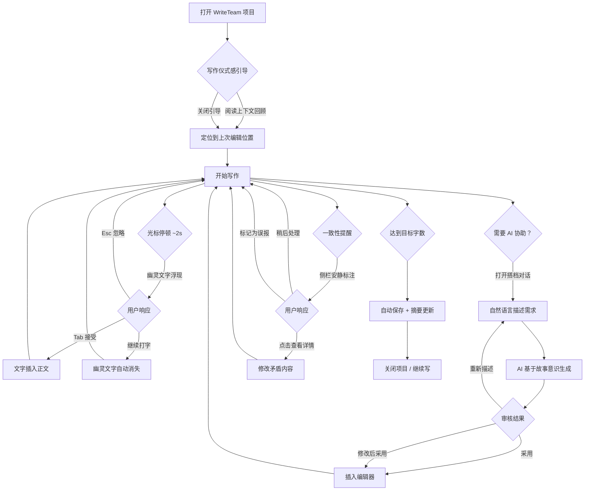
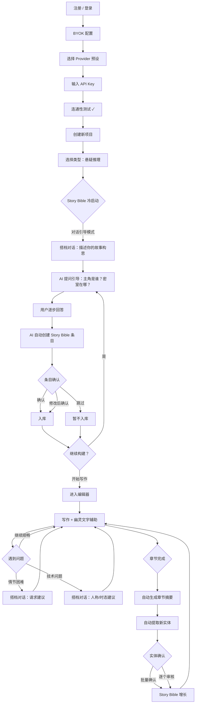
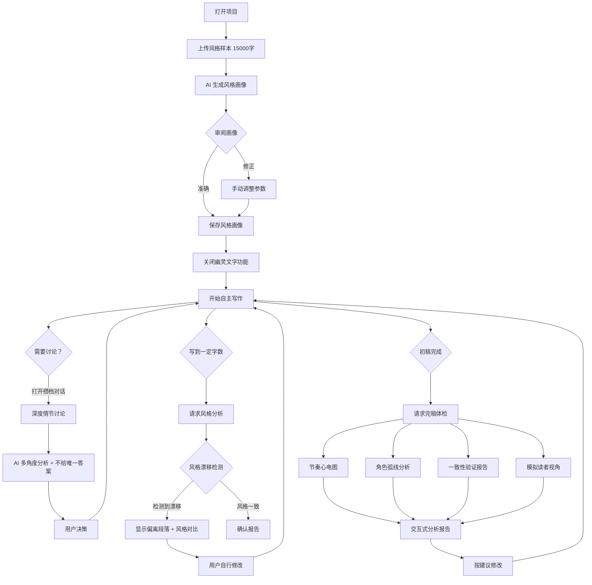

# UX Design Specification writeteam

**Author:** Elij
**Date:** 2026-03-01

---

<!-- UX design content will be appended sequentially through collaborative workflow steps -->

## Executive Summary

### Project Vision

WriteTeam v2 的 UX 愿景是将产品从"AI 写作工具集合"升级为"读过你全书的隐形编辑"——一个安静在旁边、你需要时它就在、越用越聪明的创作搭档。v1 已完成全部基础设施（22 个 AI 工具、Story Bible、Canvas、BYOK 配置、导入导出），v2 的核心命题不是加功能，而是让 AI 真正理解故事、自然地存在于写作流中、给出有深度的编辑洞察。

产品愿景三阶段递进：Phase 1 让 AI 拥有故事记忆（故事意识引擎），Phase 2 让 AI 自然融入写作（幽灵文字 + 统一搭档对话），Phase 3 让 AI 成为专业编辑（深度分析与诊断）。

### Target Users

三类典型用户：

1. **陈默型（网文日更作者）** — 120 万字长篇，每天 6000 字日更压力。最大痛苦是 30 万字后记不住伏笔和设定（读者指出角色左右手写反）。需要故事记忆、连续性守护、高效续写。代表需求：故事意识引擎、幽灵文字、写作仪式感。

2. **林小雨型（新手作者）** — 第一次写长篇，有模糊构思但不知道如何组织 10 万字叙事。需要冷启动引导、对话式 Story Bible 构建、类型特化建议。代表需求：搭档对话引导、自动实体提取、完稿体检。

3. **周远航型（严肃文学作者）** — 对 AI 生成持怀疑态度，不需要 AI 帮写但需要 AI 像编辑一样给反馈。需要风格画像、风格漂移检测、角色弧线分析。代表需求：分析功能、可关闭的生成功能、深度对话式建议。

共同特征：中文创作者、长篇叙事、需要 AI 理解故事上下文而非泛泛生成。

### Key Design Challenges

1. **"隐形"与"可见"的平衡** — 隐形编辑的核心矛盾：它要默默在场、不打扰创作心流，但又要在关键时刻（设定矛盾、伏笔提醒）及时出现。什么时候该"隐"什么时候该"现"，是整个 UX 的灵魂问题。

2. **幽灵文字的交互范式** — 行业首创（无竞品参考），需要从零设计续写文字的视觉表现、触发时机、接受/拒绝交互、与现有 AI 工具的共存关系。中文排版下灰色文字的可读性也是挑战。

3. **22 个工具 → 统一对话的迁移路径** — 不能一刀切砍掉按钮，需要设计"对话 + 按钮共存"的渐进过渡，让老用户平滑迁移、新用户自然习惯对话模式。

4. **长篇场景下的信息架构** — 10 万字+ 项目的 Story Bible 可能有 50+ 条目，章节摘要 100+，如何让作者不被自己的知识库淹没，同时确保 AI 能精准引用。

### Design Opportunities

1. **定义"AI 创作搭档"交互新品类** — 不是聊天机器人（被动回答），不是自动化工具（批量执行），而是介于两者之间的"懂你的存在"。全新交互范式，做好了就是品类定义者。

2. **中文创作的独占体验** — 中文人称系统、四字格、叠词、网文节奏（3000 字爽点）、严肃文学意象密度——英文工具永远无法复制的差异化。

3. **写作情感设计** — 写作仪式感、创作见证、温柔的回归引导——这些"非功能性"体验可能比任何功能更让用户留下来。写作是孤独的，隐形编辑的陪伴感是核心情感价值。

## Core User Experience

### Defining Experience

WriteTeam v2 的定义性体验是：**写作过程中，AI 始终在场。** 这种"在场"不是单一功能，而是三种能力的持续存在——

- **记忆**：打开项目时 AI 替你回忆上次写到哪、哪些线索悬而未决
- **直觉**：光标停顿时 AI 浮现贴合全书上下文的续写文字
- **守护**：写到矛盾之处时 AI 安静提醒你自己埋下的设定

三者缺一不完整。记忆让你快速回到故事世界，直觉让你不停笔地推进，守护让你不写崩。这就是"隐形编辑"的交互本质。

如果这个在场感做对了，所有其他体验——工具调用、Story Bible 管理、导出分享——都只是延伸。如果做错了，再多功能也只是工具集合。

用户向朋友描述时应是："这个东西比我更记得我的故事。"

### Platform Strategy

Web 应用，部署在 Vercel，桌面优先。

- **桌面（≥1024px）**：主战场。三栏布局承载完整写作体验——文档列表、编辑器、辅助面板（Story Bible / 搭档对话 / 分析视图）
- **平板/移动端**：不做专门优化。v2 全部精力聚焦桌面端的"隐形编辑"核心体验
- **交互模式**：鼠标 + 键盘为主。幽灵文字的 Tab/Esc 交互、编辑器快捷键、搭档对话的文本输入都依赖键盘
- **网络依赖**：需要在线（Supabase + BYOK LLM API），但自动保存需要断网兜底机制

### Effortless Interactions

以下交互必须零思考成本：

- **回到故事世界**：打开项目即进入上次写作位置，写作仪式感引导自动呈现相关上下文，不需要自己翻回去找
- **AI 续写**：光标处自然浮现灰色文字，Tab 接受、Esc 忽略，呼吸般自然，不需要点按钮或切面板
- **一致性守护**：系统自动检测矛盾，安静提示而非弹窗警告，不打断心流但不放过错误
- **故事知识自动维护**：章节摘要自动生成、角色状态自动追踪、Story Bible 自动建议补充——系统默默做好，用户只需偶尔审核
- **搭档对话**：想和 AI 讨论任何事，直接打字说人话，不需要记住 22 个工具分别叫什么

### Critical Success Moments

1. **"它比我更记得我的故事"时刻**（决定性时刻）：AI 提醒你一个自己已经忘了的设定细节——玉佩只在满月发热、某角色惯用右手。这是 v1 永远做不到的，是用户认知转变的拐点
2. **首次幽灵文字时刻**：第一次看到光标后浮现灰色续写，而且内容贴合前文。从"我要去调用 AI"变成"AI 就在我笔尖"
3. **写作仪式感时刻**：离开几天后重新打开项目，AI 温柔地说"上次你停在这里，这些线索还悬着"。感受到被记住
4. **搭档对话时刻**：第一次用自然语言说"帮我写一段守卫的对白，他知道玉佩来历但不愿直说"，AI 基于 Story Bible 生成贴合角色性格的内容
5. **完稿体检时刻**（Phase 3）：看到整部小说的节奏曲线、角色弧线、一致性报告。第一次有人"读完了你整本书"

### Experience Principles

1. **在场优先于功能** — 隐形编辑的价值不是能做什么，而是它始终在、始终懂
2. **自动化优先于手动** — 系统能做的就做，用户只管写作和审核。智能且强大，不当保姆
3. **安静优先于张扬** — 提醒不是弹窗，续写不是强推，对话不是抢话。隐形编辑知道什么时候该退后
4. **上下文精准优先于功能数量** — 一个理解你故事的建议，胜过十个泛泛的生成
5. **创作质量优先于创作速度** — 帮用户写得更好，而不只是写得更多

## Desired Emotional Response

### Primary Emotional Goals

WriteTeam v2 的首要情感目标是让用户感受到：**"我被理解了——有一个存在记得我的故事、懂我写到了哪里、知道什么时候该帮忙。"**

四层情感递进：

1. **被理解**（核心层）— AI 记得你的故事比你自己更清楚，生成的内容贴合你的上下文和风格。这是"隐形编辑"最本质的情感承诺。
2. **有掌控**（信任层）— AI 很强但你才是作者。它建议而不替代，提醒而不强制，你随时可以拒绝、修正、关闭。
3. **不孤独**（陪伴层）— 写作是孤独的长途。隐形编辑的仪式感回归、安静守护、创作见证让你感到有人在乎你在写。
4. **写得更好**（成就层）— 不只是更快出字，是质量在提升。AI 帮你守住一致性、发现盲点、打磨节奏，最终你的作品更好了。

### Emotional Journey Mapping

- **首次进入**：应感到"门槛不高，我能上手"。BYOK 配置简洁，创建项目快速，不被复杂功能吓退。
- **冷启动写作**：应感到"AI 在跟我一起建立对故事的理解"。对话式 Story Bible 构建、自动实体提取让知识库逐步丰富，而非空洞。
- **日常创作**：应感到"我进入了心流，AI 就在笔尖"。幽灵文字自然续写，一致性守护安静运转，搭档对话随手可聊。这是最长时间停留的阶段，安静和不打扰是关键。
- **回归写作**：应感到"被记住了"。离开几天后打开项目，AI 替你回忆上次写到哪、哪些线索悬而未决。重启摩擦降到最低。
- **发现矛盾/收到提醒**：应感到"还好有它在"。不是被批评的感觉，是被守护的感觉。像一个细心的编辑悄悄在稿子边上做了标记。
- **AI 出错时**：应感到"没关系，我能修正"。自动摘要不准可以编辑，续写不对可以忽略，系统的错误不会造成不可逆后果。容错设计建立长期信任。
- **完稿体检**：应感到"终于有人读完了我整本书"。节奏曲线、角色弧线、一致性报告——第一次用全局视角审视自己的作品，既有成就感又有明确改进方向。

### Micro-Emotions

按优先级排列：

1. **Trust over Skepticism** — AI 的每一个建议都基于对故事的理解，透明可审核。信任是隐形编辑存在的前提。
2. **Calm over Anxiety** — 安静提醒而非弹窗警告，自动保存而非手动操作，错误可修正而非不可逆。写作时保持心理安全。
3. **Accomplishment over Frustration** — 每次会话都有进展的感觉。字数在增长、Story Bible 在丰富、一致性在被守护。
4. **Understood over Generic** — AI 给出的不是通用模板，而是"这段接着你第 47 章的伏笔"。被理解的感觉是留存的根本。
5. **Empowered over Dependent** — 用户始终是作者，AI 是搭档。可以关闭任何功能，可以拒绝任何建议。能力增强而非能力替代。

### Design Implications

- **被理解 → 上下文精准**：每一次 AI 输出都必须体现对故事的理解。宁可少生成，不可乱生成。没有上下文支撑的泛泛输出比不输出更糟糕。
- **有掌控 → 可关闭、可修正、可拒绝**：幽灵文字可关闭，自动摘要可编辑，搭档对话建议可忽略。每一层 AI 能力都有用户的否决权。
- **不孤独 → 仪式感与见证**：写作仪式感回归引导、创作里程碑标记、"AI 目前理解了 12 个角色、追踪了 7 条线"的成长可视化。让陪伴感可感知。
- **写得更好 → 结果可对比**：一致性提醒让用户看到"差点写错"，风格分析让用户看到"我的风格在漂移"，完稿体检让用户看到全书质量。进步要可见。
- **AI 出错 → 零后果修正**：所有自动生成内容标记为"建议"，误操作可撤销，删除可恢复。系统出错的代价由系统承担，不转嫁给用户。

### Emotional Design Principles

1. **先让用户安心，再让用户惊喜** — 稳定可靠是基础，超预期的精准建议是加分
2. **AI 诚实优先于 AI 完美** — 不确定时说"不确定"，出错时承认，信心度透明。诚实的 AI 比全能的 AI 更值得信赖
3. **陪伴不等于打扰** — 隐形编辑的核心是"隐形"。在场但不抢话，守护但不唠叨
4. **每一个错误都可修正** — 零不可逆后果设计。用户永远有退路
5. **让创作被看见** — 写作是孤独的，但不必独自承受。里程碑、进展、成长——让努力有回响

## UX Pattern Analysis & Inspiration

### Inspiring Products Analysis

**GitHub Copilot — 幽灵文字的范式定义者**

Copilot 不是写作工具，但它定义了"内联续写"的交互范式：灰色文字浮现、Tab 接受、Esc 忽略。这个交互之所以成功，是因为它零打断——用户视线不需要离开当前位置，手不需要离开键盘，心流不需要被中断。WriteTeam 的幽灵文字直接借鉴此范式，但面临一个 Copilot 没有的挑战：代码续写的"对错"相对清晰，而小说续写的"好坏"高度主观且依赖上下文深度。

**Sudowrite — 创意写作 AI 的标杆**

- 优势：围绕创作本身组织功能（Write/Describe/Expand/Brainstorm），写作流连续，AI 工具嵌入场景自然。My Voice（风格匹配）直接证明作者风格保留的需求存在。Story Engine 3.0 展示了从大纲到散文的全流程 AI 化可能性。
- 局限：续写结果显示在右侧历史栏而非编辑器内联——这正是 WriteTeam 幽灵文字的差异化机会。无深度分析能力（不做完稿体检/节奏分析）。
- 启发：用户不需要先学系统再开始写，应先写再调优。功能命名应直觉化（Write/Describe 而非技术术语）。

**Novelcrafter — 知识库深度的天花板**

- 优势：Codex 是目前最强的写作知识库——结构化条目、自定义字段、AI 自动注入相关条目到 Prompt。Progressions（角色动态变化记录）直接启发了 WriteTeam 的角色 Progressions 设计。Scene Summaries 作为上下文传递机制是行业最佳实践。
- 局限：学习曲线陡峭——被称为"AI 写作的 Photoshop"。知识库需要手动维护（Codex 条目靠作者自己建）。
- 启发：WriteTeam 应学习 Codex 的结构化深度，但用自动化降低维护成本。Scene Summaries 自动传递是故事意识引擎的核心参考。

**Marlowe (Authors.ai) — 分析型 AI 的产品形态**

- 优势：唯一纯分析不生成的产品。22 类型基准对比、节奏模拟、角色弧线分析——直接对应 WriteTeam 的完稿体检愿景。交互式在线报告取代静态 PDF，让分析结果可操作。
- 局限：只分析不生成，需要另找工具写作。分析和写作割裂。
- 启发：WriteTeam 的独特价值在于将 Marlowe 式分析融入写作流程——不是写完再分析，而是边写边守护。

**ShyEditor — 自动实体提取的轻量参考**

- 优势：写作过程中 AI 自动建议保存实体（人物/地点/事件），Knowledge Base 自动增长。实时 AI Feedback 在写作中提供可操作建议。
- 启发：自动实体提取的交互模式值得参考——安静建议而非强制创建，用户确认即入库。

### Transferable UX Patterns

**内联交互模式（来自 Copilot）**
- 灰色文字 + Tab/Esc 的接受/拒绝交互 → 直接用于幽灵文字
- 续写内容基于上下文而非随机生成 → 故事意识引擎赋能
- 用户可完全忽略续写继续打字 → 零打断保障

**知识库自动注入（来自 Novelcrafter Codex）**
- 相关 Story Bible 条目自动注入 AI Prompt → 上下文精准
- 角色 Progressions 随章节演变 → 动态而非静态记忆
- Scene Summaries 自动传递给后续场景 → 连续性保障

**分析可视化（来自 Marlowe）**
- 节奏模拟（模拟读者翻页速度）→ 节奏心电图
- 角色弧线分析（检测发展/停滞）→ 角色弧线检测
- 类型基准对比 → 完稿体检报告

**实时反馈模式（来自 ShyEditor + Sudowrite）**
- 写作中自动检测实体并建议入库 → 自动实体提取
- 过度使用词检测 + AI 生成模式标记 → Smart Highlighting
- 侧栏非阻塞通知 → 一致性守护的交互形式

**风格学习（来自 Sudowrite My Voice）**
- 上传写作样本 → 风格画像分析
- 强度滑块调节 AI 模仿程度 → 用户掌控感
- 所有生成内容匹配作者风格 → "不像你写的"检测

### Anti-Patterns to Avoid

1. **续写结果在侧栏而非内联**（Sudowrite 当前做法）— 打断视线和心流，用户需要在两个位置之间切换注意力
2. **知识库全靠手动维护**（Novelcrafter Codex）— 小白用户维护负担过重，WriteTeam 应自动化优先
3. **学习曲线陡峭**（Novelcrafter "AI Photoshop"）— WriteTeam 目标用户包含新手作者，上手成本必须低
4. **分析和写作割裂**（Marlowe 独立于写作工具）— 完稿后才分析太晚，应边写边守护
5. **AI 输出无上下文支撑**（通用 ChatGPT/Claude）— 泛泛生成不如不生成，每次输出必须基于故事理解
6. **错误提示技术化**（v1 遗留）— 小白用户不理解协议差异，错误信息必须可执行

### Design Inspiration Strategy

**What to Adopt（直接采用）**
- Copilot 的灰色内联续写 + Tab/Esc 交互范式 → 幽灵文字的核心交互
- Novelcrafter 的 Scene Summaries 自动传递机制 → 故事意识引擎的上下文链
- Marlowe 的类型基准分析 + 交互式报告 → 完稿体检报告的产品形态

**What to Adapt（改造适配）**
- Novelcrafter Codex 的结构化知识库 → 保留深度但加自动化，降低手动维护成本
- Sudowrite My Voice 的风格学习 → 适配中文创作场景（人称、修辞、韵律）
- ShyEditor 的自动实体提取 → 融入故事意识引擎，安静建议而非强制弹窗

**What to Avoid（明确不做）**
- 不做 Sudowrite Story Engine 式全自动生成（WriteTeam 定位是搭档不是代笔）
- 不做 Novelcrafter 式陡峭学习曲线（用自动化换取低门槛）
- 不做 Marlowe 式纯分析割裂体验（分析融入写作流，不独立成产品）
- 不做 DreamGen 式无审查路线（中国市场合规约束不同）

## Design System Foundation

### 1.1 Design System Choice

选择：**Themeable System（Tailwind CSS v4 + shadcn/ui 深化）**

v1 已建立完整的基础组件层，v2 不换系统，在现有基础上构建"隐形编辑"所需的领域组件和设计 token 体系。

### Rationale for Selection

1. **与现状完全对齐**：项目已使用 Tailwind v4 + shadcn/ui + Radix UI + next-themes，零迁移成本
2. **单人开发高效率**：Elij 独立开发，优先需要可快速迭代的体系而非重建
3. **v2 新交互可扩展**：幽灵文字（TipTap Decoration）、搭档对话面板、一致性提醒、分析可视化——全部可基于现有组件模式封装
4. **跨主题兼容**：明暗主题已通过 next-themes 实现，新增语义 token 可在两套主题下一致工作
5. **社区生态强**：shadcn/ui 持续更新，新组件可直接 `npx shadcn@latest add` 引入

### Implementation Approach

- **基线保留**：`src/components/ui/*` 作为基础原语层，不修改已有组件
- **分层策略**：基础原语（ui/）→ 领域组件（editor/ai/analysis/）→ 页面组合
- **设计 token 统一**：定义颜色语义、间距节奏、状态语义、动画时序的 token 体系，替代散落的硬编码值
- **新组件规范**：v2 新增组件遵循 shadcn 模式（Radix 基础 + Tailwind 样式 + 组合式 API），不引入并行组件体系
- **优先级**：先完善写作主链路组件（幽灵文字、搭档对话、一致性提醒），再扩展分析类组件

### Customization Strategy

- **品牌层**：保持中文创作工具的专业沉浸感——温暖中性色调、长文本优化排版、安静而非花哨的视觉语言
- **状态语义层**：统一 success/warning/error/info 的颜色、图标、文案模式，尤其强化错误态的"可执行下一步"表达
- **AI 交互层**：为隐形编辑的三种在场形态设计专属视觉语言——幽灵文字（灰色半透明）、一致性提醒（非侵入式侧栏标注）、搭档对话（对话气泡 + 上下文引用卡片）
- **可访问层**：关键流程的对比度、焦点态、键盘可达优先满足 WCAG AA
- **扩展规则**：每次新增或修改组件都回归桌面 + 明暗主题一致性

## 2. Core User Experience

### 2.1 Defining Experience

WriteTeam v2 的定义性交互是：**用户在编辑器中持续写作，AI 基于对全书的深度理解，以三种形态自然融入写作流——记忆引导进入、直觉续写推进、守护保证一致。**

如果用一句话向朋友描述："这个东西比我更记得我的故事。"

这不是某个功能按钮的体验，而是一种持续存在的"被理解感"。它改变的不是某个操作的效率，而是整个写作过程中"AI 是否真正在场"的感知。

### 2.2 User Mental Model

**用户当前心理模型：**
- "AI 是一个按需调用的工具" — 我选中文本，点一个按钮，AI 给我一个结果。用完放下。
- "AI 不了解我的故事" — 每次调用 AI 都要重新解释上下文，或者忍受与前文矛盾的输出。
- "Story Bible 是我自己维护的笔记本" — 我写条目，AI 读条目。如果我忘了维护，AI 也忘了。

**v2 要建立的新心理模型：**
- "AI 一直在读我写的东西" — 不是我调用它时它才知道，它一直在理解。
- "AI 比我更记得细节" — 我忘了的伏笔、矛盾的设定，它没忘。
- "我只管写，它负责记住" — Story Bible 会自动丰富，章节摘要自动生成，角色变化自动追踪。

**用户对现有方案的认知：**
- 喜欢：Sudowrite 的写作流一体化，Novelcrafter 的 Codex 知识库深度
- 痛点：所有工具都"不记得"——每次调用 AI 都像第一次见面。Codex 需要手动维护太累
- 期望：一个"读过你全书的编辑"，不需要你反复告诉它故事是什么

### 2.3 Success Criteria

核心交互成功标准：

1. **上下文贴合度**：AI 生成的任何内容（续写、改写、建议）都体现对前文的理解。用户不需要在 Prompt 里重复交代背景
2. **矛盾检出率**：5 万字以上项目中，AI 能检测并提醒角色/设定/时间线矛盾。用户感到"它在守护我的故事"
3. **零打断心流**：幽灵文字、一致性提醒、自动保存——所有 AI 行为都不强制用户停下来处理。可以完全忽略继续写
4. **自动化可信度**：自动生成的章节摘要、实体提取、角色 Progressions 的准确率足够高，用户只需偶尔修正而非反复纠错
5. **回归零摩擦**：离开数天后重新打开项目，3 秒内知道上次写到哪、哪些线索悬而未决

### 2.4 Novel UX Patterns

**行业首创：幽灵文字**
- 截至 2026 年，无任何主流小说写作工具实现真正的编辑器内联灰色续写文本
- 交互范式从 GitHub Copilot 迁移，但需要解决小说场景的特有挑战：续写质量高度依赖上下文深度、中文排版下灰色文字可读性、文学风格匹配
- 需要教育用户的新模式：Tab 接受、Esc 忽略、继续打字自动消失。通过首次使用引导完成

**组合创新：分析融入写作流**
- 成熟模式的新组合：Marlowe 式分析能力 + Sudowrite 式写作流 = 边写边守护
- 一致性提醒不是事后检查报告，是写作过程中的实时侧栏标注
- 用户不需要学新交互，提醒以已有的侧栏通知模式呈现

**渐进转换：22 工具 → 统一对话**
- 不是全新模式，是渐进迁移：对话入口和按钮工具共存
- 对话通过 Slash 命令（`/改写 这段太拖沓了`）或自然语言触发
- 老用户可以继续用按钮，新用户自然从对话开始

### 2.5 Experience Mechanics

**1) Initiation（进入写作）**
- 用户打开项目 → 自动定位到上次编辑位置
- 写作仪式感引导浮现："上次你停在林澈进入地下遗迹。玉佩线索连接第 47 章和第 213 章。"
- 模型状态可见（健康/不可用），但不阻塞进入编辑器

**2) Interaction（持续写作）**
- **幽灵文字**：光标停顿 ~2 秒 → 灰色续写文字流式浮现 → Tab 接受 / Esc 忽略 / 继续打字自动消失
- **搭档对话**：右侧面板随时可打开，打字即触发（自然语言或 Slash 命令）。AI 回复基于故事意识引擎的完整上下文
- **一致性守护**：后台持续分析当前写作内容 vs Story Bible + 章节摘要。检测到矛盾时在侧栏安静标注（非弹窗）
- **自动知识维护**：写作过程中自动提取新实体建议入库、章节完成时自动生成摘要、角色状态变化自动记录 Progressions

**3) Feedback（系统反馈）**
- 成功态：幽灵文字被接受后无缝插入正文，无额外确认步骤
- 提醒态：一致性提醒在侧栏以非阻塞标注呈现，点击可查看详情和建议修改
- 自动态：Story Bible 新增建议条目以"待确认"状态呈现，用户可一键确认或忽略
- 错误态：AI 请求失败时给出可执行下一步（重试/换模型/继续写作），保留已有上下文

**4) Completion（会话结束）**
- 自动保存全程运行（1s debounce），用户无需手动保存
- 关闭前系统已自动更新章节摘要、角色 Progressions、实体库
- 下次打开时写作仪式感引导基于本次会话的最新状态

## Visual Design Foundation

### Color System

**基线保留：** v1 使用 shadcn/ui 默认 oklch 色彩系统（zinc 色调），通过 CSS 变量实现明暗主题切换。v2 在此基础上扩展 AI 交互语义色彩层。

**核心色彩 Token（已有）：**

| Token | Light Mode | Dark Mode | 用途 |
|-------|-----------|-----------|------|
| `--background` | `oklch(1 0 0)` | `oklch(0.141 0.005 285.823)` | 全局背景 |
| `--foreground` | `oklch(0.141 0.005 285.823)` | `oklch(0.985 0 0)` | 正文文字 |
| `--primary` | `oklch(0.21 0.006 285.885)` | `oklch(0.92 0.004 286.32)` | 主操作/强调 |
| `--muted` | `oklch(0.967 0.001 286.375)` | `oklch(0.274 0.006 286.033)` | 次级背景 |
| `--muted-foreground` | `oklch(0.552 0.016 285.938)` | `oklch(0.705 0.015 286.067)` | 次级文字/占位 |
| `--destructive` | `oklch(0.577 0.245 27.325)` | `oklch(0.704 0.191 22.216)` | 错误/危险 |
| `--border` | `oklch(0.92 0.004 286.32)` | `oklch(1 0 0 / 10%)` | 边框 |
| `--card` | `oklch(1 0 0)` | `oklch(0.21 0.006 285.885)` | 卡片背景 |

**v2 新增语义 Token：**

| Token | 含义 | Light 建议值 | Dark 建议值 |
|-------|------|-------------|-------------|
| `--ghost-text` | 幽灵文字颜色 | `oklch(0.65 0.01 286 / 60%)` | `oklch(0.55 0.01 286 / 50%)` |
| `--ghost-text-bg` | 幽灵文字背景 | `transparent` | `transparent` |
| `--consistency-alert` | 一致性提醒强调 | `oklch(0.75 0.15 65)` | `oklch(0.65 0.12 65)` |
| `--consistency-alert-bg` | 一致性提醒背景 | `oklch(0.97 0.03 85)` | `oklch(0.25 0.03 85)` |
| `--auto-suggestion` | 自动建议标记 | `oklch(0.65 0.1 220)` | `oklch(0.55 0.1 220)` |
| `--auto-suggestion-bg` | 自动建议卡片背景 | `oklch(0.97 0.02 230)` | `oklch(0.22 0.02 230)` |
| `--companion-accent` | 搭档对话强调 | `oklch(0.6 0.15 270)` | `oklch(0.55 0.15 270)` |
| `--analysis-viz` | 分析可视化色系 | chart-1 ~ chart-5 复用 | chart-1 ~ chart-5 复用 |
| `--ritual-glow` | 写作仪式感引导 | `oklch(0.85 0.08 80)` | `oklch(0.45 0.08 80)` |

**色彩原则：**
- 编辑器正文区域保持极简的前景/背景二色对比，AI 元素通过透明度而非色相区分
- 幽灵文字使用 `muted-foreground` 的降透明度变体，确保与正文有清晰视觉层级
- 一致性提醒使用暖色（琥珀/金色系），传达"提醒"而非"错误"的情绪
- 自动建议使用冷色（蓝色系），传达"系统智能"的中性感
- destructive 仅用于不可恢复操作确认，日常错误用 warning 色调

### Typography

**字体栈（已有）：**
- **主字体**：`var(--font-geist-sans)` — Geist Sans，现代无衬线，适合 UI 元素和中文混排
- **等宽字体**：`var(--font-geist-mono)` — Geist Mono，代码块和技术信息

**v2 编辑器排版规范：**

| 场景 | 字号 | 行高 | 字重 | 说明 |
|------|------|------|------|------|
| **编辑器正文** | 18px | 1.8 (32.4px) | 400 | 长文本阅读最优，中文排版标准 |
| **幽灵文字** | 18px（同正文） | 1.8 | 400 | 仅通过颜色/透明度区分，字体完全一致 |
| **搭档对话-用户** | 15px | 1.6 | 400 | 对话面板内，紧凑但可读 |
| **搭档对话-AI** | 15px | 1.6 | 400 | 同用户消息，但添加左侧色条标记 |
| **一致性提醒** | 13px | 1.5 | 500 | 侧栏标注，紧凑且醒目 |
| **Story Bible 条目** | 14px | 1.6 | 400 | 面板内浏览，信息密度适中 |
| **章节标题** | 24px | 1.4 | 600 | 编辑器内 H1 |
| **场景分隔** | 16px | 1.6 | 500 | 编辑器内 H2/H3 |

**排版原则：**
- 编辑器正文 `line-height: 1.8` 是中文长文本的黄金比例（已在 globals.css 中设定）
- 幽灵文字与正文使用完全相同的字体、字号、行高，仅通过 `color: var(--ghost-text)` 区分
- 对话面板和侧栏面板使用更紧凑的排版以节省空间
- 段落间距 `margin: 0.75em 0`（已有），段首不缩进（Web 排版惯例）

### Spacing System

**基础网格：** 4px 基线（Tailwind 默认），实际使用以 8px 为主要节奏单位。

**三栏布局尺寸：**

```
┌──────────┬──────────────────────────────────┬──────────┐
│  左侧栏   │           编辑器主区域             │  右侧面板  │
│ 240-280px │    flex-1 (min 600px, 最优 720px)  │ 320-400px │
│ 可折叠    │     居中，max-width 限制阅读宽度     │  可折叠   │
└──────────┴──────────────────────────────────┴──────────┘
```

| 区域 | 宽度 | 折叠行为 |
|------|------|---------|
| **左侧栏（文档列表）** | 240-280px | 可折叠为 48px 图标栏 |
| **编辑器主区域** | flex-1, min 600px | 不可折叠，内容区 max-width 720px 居中 |
| **右侧面板（AI/SB）** | 320-400px | 可折叠为 0px（完全隐藏） |

**关键间距规范：**
- 面板内边距：`16px`（紧凑面板）/ `24px`（编辑器区域）
- 组件间距：`8px`（紧凑）/ `12px`（标准）/ `16px`（宽松）
- 编辑器内容与边缘：`24px` 左右 padding，内容 max-width 720px
- AI 面板卡片间距：`8px`
- 工具栏按钮间距：`4px`
- 段落间距：`12px`（0.75em at 16px base）

### Accessibility Foundation

**目标等级：WCAG 2.1 AA**

**核心要求：**

| 维度 | 要求 | 说明 |
|------|------|------|
| **文本对比度** | ≥4.5:1（正文）/ ≥3:1（大文本） | 使用 oklch 色彩系统天然满足 |
| **幽灵文字对比度** | ≥3:1 | 作为"装饰性建议"文本，适用大文本标准 |
| **触控目标** | ≥44×44px | 按钮、Tab 切换、面板操作 |
| **焦点指示器** | 可见焦点环 | `outline-ring/50` 已在 globals.css 全局设定 |
| **键盘导航** | 完整 Tab 序列 | 编辑器 → 工具栏 → 面板 → 对话输入 |
| **色彩不依赖** | 状态不仅靠颜色 | 一致性提醒同时有图标+文字+色彩 |

**幽灵文字无障碍设计：**
- Tab 键接受、Esc 键忽略的交互必须有 ARIA 标注
- 幽灵文字区域声明为 `role="suggestion"` + `aria-label="AI 续写建议"`
- 屏幕阅读器可跳过幽灵文字（`aria-hidden` 可配置）
- 提供快捷键 `Ctrl+Shift+G` 全局开关幽灵文字

**键盘快捷键体系：**
- `Tab` — 接受幽灵文字
- `Esc` — 忽略幽灵文字
- `Ctrl+/` — 打开/关闭搭档对话面板
- `Ctrl+Shift+B` — 打开/关闭 Story Bible 面板
- `Ctrl+S` — 手动保存（虽有自动保存，但保留心理安全感）

## Design Direction Decision

### Design Directions Explored

基于 v2"隐形编辑"愿景和视觉基础，探索了以下设计方向：

**方向 A："编辑桌"（The Editor's Desk）**
- 意象：老式编辑部的大木桌——温暖、专注、功能性
- 色调：暖灰为主，琥珀色点缀（一致性提醒），木纹质感边框
- 布局：传统三栏，左栏窄小不抢戏，编辑器占据绝对视觉中心
- AI 存在感：极低。幽灵文字几乎与背景融合，仅在细看时可见。对话面板藏在右侧

**方向 B："隐形搭档"（The Invisible Partner）**
- 意象：安静的图书馆——白色、干净、AI 元素通过微动效暗示存在
- 色调：纯白/纯黑双极，AI 元素使用淡蓝微光
- 布局：编辑器全屏为主，面板按需浮出（非固定栏位）
- AI 存在感：动态。空闲时隐形，触发时以优雅动画浮现

**方向 C："创作工坊"（The Writer's Workshop）**
- 意象：手工作坊——工具唾手可得，有序但丰富
- 色调：中性灰底色 + 多色功能标签（蓝=AI，绿=确认，琥珀=提醒）
- 布局：信息密度较高的三栏，右侧面板同时可显示多个工具窗格
- AI 存在感：中高。多个 AI 功能同时可见，类似 IDE 的多面板布局

### Chosen Direction

**选定方向：方向 A "编辑桌" 为基础，融入方向 B 的动态存在感设计。**

命名：**"安静的在场"（Quiet Presence）**

### Design Rationale

1. **符合"隐形编辑"核心隐喻**：编辑桌的温暖克制感与"安静在旁边"的产品定位完全吻合。不是冰冷的技术工具，是有温度的创作空间。

2. **编辑器中心主义**：方向 A 的编辑器视觉权重最高，确保用户视线始终在文字上——这是写作工具的第一原则。

3. **动态存在感弥补静态不足**：纯方向 A 的 AI 存在感过低，融入方向 B 的"空闲隐形、触发浮现"逻辑，让隐形编辑在关键时刻（幽灵文字出现、一致性提醒、仪式感引导）以微妙动效显现。

4. **避免方向 C 的信息过载**：创作工坊的高信息密度适合 Novelcrafter 的"AI Photoshop"定位，但与 WriteTeam 的低门槛、零打扰理念矛盾。

5. **中文长文本适配**：温暖中性色调 + 充分留白 + 1.8 行高的编辑器排版，是中文长文本阅读/写作的最佳环境。

### Design Direction Implementation

**视觉关键词：** 温暖、克制、专注、有呼吸感

**动效原则：**
- 幽灵文字：`fade-in 300ms ease-out`，逐字符流式渲染，如墨水慢慢浮现
- 一致性提醒：`slide-in-right 200ms ease-out`，从右侧栏滑入
- 面板切换：`width transition 250ms ease-in-out`，平滑展开/折叠
- 搭档对话回复：`fade-in 200ms` + 打字机效果（流式渲染）
- 写作仪式感引导：`fade-in 500ms ease-out`，缓慢浮现，3 秒后可手动关闭

**阴影与层级：**
- 编辑器区域：无阴影（主舞台，平面）
- 浮动面板/弹出层：`shadow-lg`（需要明确层级关系时）
- 幽灵文字：零阴影零边框（纯文字装饰层）
- 一致性提醒卡片：`shadow-sm`（轻微浮起感）

## User Journey Flows

### Journey 1：陈默的日更写作流

**场景**：第 381 章日更，需要 6000 字，90 分钟内完成。


```mermaid
flowchart TD
    A[打开 WriteTeam 项目] --> B{写作仪式感引导}
    B --> |阅读上下文回顾| C[定位到上次编辑位置]
    B --> |关闭引导| C
    C --> D[开始写作]

    D --> E{光标停顿 ~2s}
    E --> |幽灵文字浮现| F{用户响应}
    F --> |Tab 接受| G[文字插入正文]
    F --> |Esc 忽略| D
    F --> |继续打字| H[幽灵文字自动消失]
    G --> D
    H --> D

    D --> I{需要 AI 协助？}
    I --> |打开搭档对话| J[自然语言描述需求]
    J --> K[AI 基于故事意识生成]
    K --> L{审核结果}
    L --> |采用| M[插入编辑器]
    L --> |修改后采用| M
    L --> |重新描述| J
    M --> D

    D --> N{一致性提醒}
    N --> |侧栏安静标注| O{用户响应}
    O --> |点击查看详情| P[修改矛盾内容]
    O --> |稍后处理| D
    O --> |标记为误报| D
    P --> D

    D --> Q{达到目标字数}
    Q --> R[自动保存 + 摘要更新]
    R --> S[关闭项目 / 继续写]
```

**关键交互节点：**
- **仪式感引导**（3-5 秒浮现）：显示上次停笔位置 + 悬而未决线索 + 本章建议聚焦点
- **幽灵文字循环**：每次停顿触发，接受率目标 ≥25%，拒绝/忽略零代价
- **搭档对话**：右侧面板，对话历史保留本次会话，AI 回复引用 Story Bible 条目
- **一致性提醒**：非阻塞，不弹窗，侧栏图标 + 数字 badge 指示待处理提醒数

### Journey 2：林小雨的冷启动构建

**场景**：首次使用，从零构建悬疑推理小说。


```mermaid
flowchart TD
    A[注册 / 登录] --> B[BYOK 配置]
    B --> B1[选择 Provider 预设]
    B1 --> B2[输入 API Key]
    B2 --> B3[连通性测试 ✓]
    B3 --> C[创建新项目]

    C --> D[选择类型：悬疑推理]
    D --> E{Story Bible 冷启动}
    E --> |对话引导模式| F[搭档对话：描述你的故事构思]
    F --> G[AI 提问引导：主角是谁？密室在哪？]
    G --> H[用户逐步回答]
    H --> I[AI 自动创建 Story Bible 条目]
    I --> J{条目确认}
    J --> |确认| K[入库]
    J --> |修改后确认| K
    J --> |跳过| L[暂不入库]
    K --> M{继续构建？}
    L --> M
    M --> |是| G
    M --> |开始写作| N[进入编辑器]

    N --> O[写作 + 幽灵文字辅助]
    O --> P{遇到问题}
    P --> |情节困难| Q[搭档对话：请求建议]
    P --> |技术问题| R[搭档对话：人称/时态建议]
    P --> |继续顺畅| O
    Q --> O
    R --> O

    O --> S{章节完成}
    S --> T[自动生成章节摘要]
    T --> U[自动提取新实体]
    U --> V{实体确认}
    V --> |批量确认| W[Story Bible 增长]
    V --> |逐个审核| W
    W --> O
```

**关键交互节点：**
- **BYOK 配置**：Provider 预设一键选择（DeepSeek/OpenAI/硅基流动），API Key 输入 + 实时验证，3 步完成
- **对话式 Story Bible 构建**：AI 作为创作教练，通过提问引导用户从模糊构思到结构化世界观
- **类型感知**：选择"悬疑推理"后，AI 的提问方向（诡计设计、线索链、红鲱鱼）和建议都特化
- **实体自动提取**：写作中 AI 识别新角色/地点/物品，以"待确认"卡片呈现，用户一键确认或忽略

### Journey 3：周远航的分析审阅流

**场景**：不用 AI 写作，只用分析和深度讨论。


```mermaid
flowchart TD
    A[打开项目] --> B[上传风格样本 15000字]
    B --> C[AI 生成风格画像]
    C --> D{审阅画像}
    D --> |准确| E[保存风格画像]
    D --> |修正| F[手动调整参数]
    F --> E

    E --> G[关闭幽灵文字功能]
    G --> H[开始自主写作]

    H --> I{需要讨论？}
    I --> |打开搭档对话| J[深度情节讨论]
    J --> K[AI 多角度分析 + 不给唯一答案]
    K --> L[用户决策]
    L --> H

    H --> M{写到一定字数}
    M --> N[请求风格分析]
    N --> O{风格漂移检测}
    O --> |检测到漂移| P[显示偏离段落 + 风格对比]
    O --> |风格一致| Q[确认报告]
    P --> R[用户自行修改]
    R --> H

    H --> S{初稿完成}
    S --> T[请求完稿体检]
    T --> U[节奏心电图]
    T --> V[角色弧线分析]
    T --> W[一致性验证报告]
    T --> X[模拟读者视角]
    U & V & W & X --> Y[交互式分析报告]
    Y --> Z[按建议修改]
    Z --> H
```

**关键交互节点：**
- **功能可关闭**：幽灵文字、自动建议均可单独关闭，尊重"不需要 AI 帮写"的用户
- **风格画像**：上传样本后 AI 分析出量化的风格维度（句长分布、修辞密度、对话比例、叙事视角偏好）
- **搭档对话-讨论模式**：AI 不给答案，给多角度分析。"隐忍更符合前三章性格，但爆发能制造转折"
- **完稿体检**（Phase 3）：交互式报告而非静态 PDF，可点击节奏低谷直接跳转到对应章节

### Journey Patterns

**跨旅程共性模式：**

1. **渐进式上下文建立**：所有旅程都从"AI 不了解故事"逐步到"AI 深度理解"——区别在于速度（陈默已有 380 章 → 即时；林小雨从零 → 对话引导；周远航只要分析 → 风格样本）

2. **非阻塞反馈循环**：AI 的所有输出（幽灵文字、一致性提醒、自动实体、搭档回复）都是建议性质，用户可忽略/延后/拒绝，零强制中断

3. **对话作为统一入口**：三类用户最终都通过搭档对话与 AI 深度交互——陈默要角色对白，林小雨要构思引导，周远航要情节讨论

4. **自动化减轻维护负担**：章节摘要自动生成、实体自动提取、角色 Progressions 自动记录——用户只审核不创建

### Flow Optimization Principles

1. **零步骤到写作**：打开项目 → 直接在上次位置继续写。仪式感引导是叠加层不是阻塞层
2. **AI 错误优雅降级**：API 调用失败 → 显示错误 + 可执行下一步（重试/换模型/离线继续写）→ 保留已有上下文不丢失
3. **批量操作减少决策疲劳**：实体确认支持批量操作，自动摘要支持"全部接受"
4. **上下文跟随视线**：AI 面板内容始终关联当前编辑位置的上下文，不需要用户手动指定"看这段"

## Component Strategy

### Design System Components

**从 shadcn/ui 直接复用的基础组件：**

| 组件 | 用途 | 定制程度 |
|------|------|---------|
| Button | 全局操作按钮 | 新增 `ghost-ai` variant |
| Input / Textarea | 表单输入、搭档对话输入 | 无需定制 |
| Dialog / AlertDialog | 确认操作、设置弹窗 | 无需定制 |
| DropdownMenu | 工具栏菜单 | 无需定制 |
| Tooltip | 快捷键提示、功能说明 | 无需定制 |
| ScrollArea | 长列表滚动（文档列表、SB 条目） | 无需定制 |
| Tabs | 右侧面板切换 | 无需定制 |
| Badge | 状态标记、提醒计数 | 新增语义 variant |
| Skeleton | 加载占位 | 无需定制 |
| Toast | 操作反馈 | 统一中文文案规范 |
| Sheet | 移动端抽屉（预留） | 无需定制 |
| Separator | 分区线 | 无需定制 |
| Toggle / ToggleGroup | 功能开关（幽灵文字启用等） | 无需定制 |

### Custom Components

**以下组件是 v2 核心体验所需，shadcn/ui 无对应实现，必须自定义开发：**

#### 1. GhostText（幽灵文字）

**Purpose:** 编辑器内联 AI 续写建议，Copilot 风格的灰色预测文本
**Technical Base:** TipTap Decoration Plugin
**Anatomy:**
- 灰色半透明文本（`color: var(--ghost-text)`），跟随光标位置
- 无边框、无背景、无阴影——纯文本装饰层
- 逐字符流式渲染动画（`fade-in 300ms`）

**States:**
| 状态 | 表现 |
|------|------|
| Idle | 无内容，不可见 |
| Loading | 光标位置微弱脉动指示器（可选） |
| Showing | 灰色文本流式出现 |
| Accepted | 文本变为正文颜色，无缝插入 |
| Dismissed | 淡出消失（`fade-out 150ms`） |
| Disabled | 全局关闭，不触发请求 |

**Interaction:**
- 触发：光标停顿 ≥2 秒 + 当前行有内容
- `Tab` → 接受全部 → 文本颜色过渡为 foreground
- `Esc` → 忽略 → 淡出
- 继续打字 → 自动消失 → 新一轮等待
- `Ctrl+→` → 接受一个词（可选增强）

**Accessibility:**
- `role="suggestion"`, `aria-label="AI 续写建议，按 Tab 接受，Esc 忽略"`
- 屏幕阅读器模式下可配置为静默（`aria-hidden="true"`）

#### 2. CompanionDialog（搭档对话面板）

**Purpose:** 统一的 AI 交互入口，替代 22 个独立工具按钮
**Technical Base:** 右侧面板 Tab 页，对话式 UI
**Anatomy:**
- 对话历史区域（ScrollArea）
- 用户消息气泡（右对齐，`bg-muted`）
- AI 回复气泡（左对齐，左侧 `border-l-2 border-companion-accent`）
- 上下文引用卡片（AI 回复中引用 Story Bible 条目时显示）
- 输入区域（Textarea + 发送按钮 + Slash 命令提示）

**States:**
| 状态 | 表现 |
|------|------|
| Empty | 欢迎语 + 快速操作建议（"你可以问我..."） |
| Input | 输入框激活，支持 `/` 触发 Slash 命令菜单 |
| Streaming | AI 回复流式渲染，打字机效果 |
| Complete | AI 回复完成，操作按钮可见（复制/插入/重新生成） |
| Error | 错误信息 + 重试按钮 + 换模型建议 |

**Slash 命令：**
- `/改写` — 改写选中文本
- `/续写` — 从当前位置续写
- `/扩写` — 扩展选中段落
- `/缩写` — 精简选中段落
- `/角色` — 角色对白/分析
- `/brainstorm` — 头脑风暴
- 自然语言直接输入亦可，AI 自动路由到对应功能

#### 3. ConsistencyAlert（一致性提醒）

**Purpose:** 实时矛盾检测的非阻塞侧栏通知
**Technical Base:** 自定义侧栏浮层组件
**Anatomy:**
- 侧栏小图标（琥珀色圆点 + 数字 badge）
- 展开后：提醒卡片列表
- 卡片内容：矛盾描述 + 来源引用（"第 X 章第 Y 段"）+ 建议修改 + 操作按钮

**States:**
| 状态 | 表现 |
|------|------|
| No Alerts | 无图标显示 |
| New Alert | 琥珀色圆点 + 数字 badge，`slide-in-right 200ms` |
| Expanded | 提醒卡片列表展开 |
| Resolved | 卡片标记为已处理，`fade-out` |
| Dismissed | 标记为误报，不再显示 |

**Interaction:**
- 点击 badge → 展开提醒列表
- 点击卡片 → 编辑器滚动到相关段落并高亮
- "接受建议" → 自动替换矛盾文本
- "忽略" → 标记为已处理
- "误报" → 标记为误报，优化后续检测

#### 4. WritingRitual（写作仪式感引导）

**Purpose:** 项目回归时的上下文回忆引导
**Technical Base:** 全屏叠加层（Overlay），3-5 秒渐显
**Anatomy:**
- 半透明背景遮罩
- 居中卡片：上次停笔位置 + 悬而未决线索 + 本章建议聚焦点
- "继续写作" 按钮（主操作）
- "查看详情" 链接（展开更多上下文）
- 自动消失倒计时（5 秒后 fade-out，或用户点击任意位置关闭）

**States:**
| 状态 | 表现 |
|------|------|
| Loading | 骨架屏（Skeleton），等待上下文组装 |
| Showing | 卡片 `fade-in 500ms`，内容逐行显示 |
| Expanded | 展开完整线索列表和关联章节 |
| Dismissed | `fade-out 300ms` + 编辑器获得焦点 |
| Disabled | 用户关闭此功能，不再显示 |

#### 5. AnalysisDashboard（分析仪表盘）— Phase 3

**Purpose:** 完稿体检的交互式报告视图
**Technical Base:** 右侧面板全屏展开模式
**Anatomy:**
- Tab 导航：节奏心电图 | 角色弧线 | 一致性报告 | 模拟读者
- 图表区域：基于 chart-1~5 色彩变量的 SVG/Canvas 可视化
- 问题列表：可点击跳转到编辑器对应位置
- 导出按钮：生成 PDF/Markdown 报告

#### 6. EntitySuggestion（实体建议卡片）

**Purpose:** 自动实体提取后的确认/入库交互
**Technical Base:** Toast 变体或侧栏浮层
**Anatomy:**
- 实体名称 + 类型标签（角色/地点/物品/事件）
- AI 提取的简要描述
- 操作：确认入库 / 编辑后入库 / 忽略 / 批量操作

### Component Implementation Strategy

**分层构建原则：**
```
Layer 0: shadcn/ui 原语（Button, Input, Dialog...）
Layer 1: 领域基础组件（GhostText, CompanionDialog, ConsistencyAlert）
Layer 2: 组合组件（WritingRitual = Overlay + Card + SB Context + Animation）
Layer 3: 页面级组合（EditorShell 集成所有 Layer 1-2 组件）
```

**构建规范：**
- 所有自定义组件使用 Tailwind 类名 + CSS 变量（不写内联样式）
- 动效使用 `tw-animate-css` 或 CSS transition（不引入 framer-motion）
- 状态管理：组件内部状态用 `useState`，跨组件状态用 React Context 或 Zustand
- AI 交互组件统一使用 SSE 流式渲染模式（已有 `openai-stream.ts` 基础设施）

### Component Implementation Roadmap

**Phase 1（故事意识引擎 MVP）— 必须：**
- WritingRitual（写作仪式感引导）
- ConsistencyAlert（一致性提醒）— 基础版
- EntitySuggestion（实体建议卡片）
- Story Bible 增强（Progressions 字段、自动摘要标记）

**Phase 2（交互革新）— 核心：**
- GhostText（幽灵文字）— 最复杂的组件，TipTap Decoration 集成
- CompanionDialog（搭档对话面板）— 合并现有 AI Chat + 22 工具
- Slash 命令系统（对话输入框内的命令菜单）
- Smart Highlighting（过度使用词 + AI 生成标记）

**Phase 3（深度编辑智慧）— 进阶：**
- AnalysisDashboard（分析仪表盘）
- 节奏心电图可视化组件
- 角色弧线可视化组件
- 风格画像展示组件
- 完稿体检报告导出

## UX Consistency Patterns

### Button Hierarchy

**三级按钮体系：**

| 级别 | Variant | 用途 | 示例 |
|------|---------|------|------|
| **Primary** | `default` | 主操作，每屏最多 1 个 | "继续写作"、"确认入库"、"保存项目" |
| **Secondary** | `outline` / `secondary` | 次级操作 | "查看详情"、"编辑"、"展开" |
| **Ghost** | `ghost` | 工具栏操作、可重复操作 | AI 工具按钮、面板切换、格式化 |

**AI 专属按钮：**
- `ghost-ai` variant：`ghost` 基础 + `hover:bg-auto-suggestion-bg` + AI 图标前缀
- 用于搭档对话的"插入编辑器"、"重新生成"等操作

**操作分组规则：**
- 确认/取消操作：确认在右，取消在左，颜色区分（primary vs ghost）
- 危险操作：使用 `destructive` variant + AlertDialog 二次确认
- AI 生成结果操作：采用/修改/重新生成 三选一横排

### Feedback Patterns

**四级反馈体系：**

| 级别 | 触发 | 表现形式 | 持续时间 |
|------|------|---------|---------|
| **Success** | 操作成功 | Toast（底部右侧）+ 绿色 check 图标 | 3 秒自动消失 |
| **Info** | 系统通知 | Toast 或侧栏标注 | 5 秒或手动关闭 |
| **Warning** | 一致性提醒 | 侧栏琥珀色卡片（非阻塞） | 持久，手动处理 |
| **Error** | 操作失败 | Toast（底部右侧）+ 可执行下一步 | 手动关闭 |

**AI 反馈特殊模式：**
- **流式渲染中**：骨架屏 → 逐字符出现（打字机效果）
- **AI 错误**：不说"Error 500"，说"AI 暂时没有响应，你可以：①重试 ②换一个模型 ③先继续写作"
- **自动操作完成**：章节摘要生成后，Toast 显示"第 X 章摘要已自动生成"+ "查看" 链接

**中文错误文案规范：**
- 永远给出可执行的下一步
- 不暴露技术细节（不说 "HTTP 429 Rate Limit"，说 "请求太频繁，请稍后重试"）
- 语气温和，不用感叹号

### Form Patterns

**BYOK 配置表单：**
- Provider 预设下拉 → API Key 输入（密码模式 + 显示/隐藏切换）→ 实时连通性测试
- 验证反馈：✓ 绿色 "连接成功" / ✗ 红色 "连接失败：[可执行建议]"
- 表单自动保存到 localStorage，无需手动提交

**Story Bible 条目编辑：**
- 行内编辑模式：点击条目 → 直接编辑 → 失焦自动保存
- 新增条目：底部 "+" 按钮 → 空白卡片 → 输入名称即创建
- 自动建议的待确认条目：虚线边框 + "AI 建议" 标签 + 确认/忽略操作

**通用规则：**
- 必填字段用 `*` 标记，而非红色边框（区分未填和出错）
- 实时校验优先于提交后校验
- 长表单分步骤（Stepper），不做单页长滚动

### Navigation Patterns

**全局导航：**
- 左侧栏：项目文档树（可折叠）
- 顶部：极简——项目名 + 字数统计 + 模型状态指示器 + 用户头像
- 右侧面板切换：Tab 组（Story Bible / 搭档对话 / 分析 / 灵感）

**编辑器内导航：**
- 文档内跳转：Ctrl+G 跳转到章节
- Story Bible 引用跳转：点击 AI 回复中的引用卡片 → 跳转到对应 SB 条目
- 一致性提醒跳转：点击提醒卡片 → 编辑器滚动到矛盾段落

**面板切换模式：**
- 右侧面板 Tab 切换：点击 Tab 展开/切换，再次点击当前 Tab 则折叠面板
- 左侧栏折叠：点击折叠按钮 → 过渡为 48px 图标栏
- 快捷键：`Ctrl+/`（搭档对话）、`Ctrl+Shift+B`（Story Bible）

### AI Interaction Patterns

**统一交互原则：**

1. **AI 输出始终标记来源**：所有 AI 生成内容标记为"AI 建议"，与用户原创内容视觉区分
2. **接受前可预览**：幽灵文字在正文位置预览，搭档对话结果在面板预览，确认后才插入
3. **拒绝零代价**：忽略幽灵文字、关闭搭档回复、忽略一致性提醒——所有操作 1 键完成
4. **上下文引用透明**：AI 回复引用了哪些 Story Bible 条目，以小卡片形式展示
5. **信心度标记**：AI 不确定时标注"参考建议"，高确信时标注"基于第 X 章设定"

**AI 等待状态：**
- 幽灵文字：光标右侧微弱脉动点（3 个 dot 呼吸动画）
- 搭档对话：气泡区域骨架屏 + "正在思考…"
- 一致性检测：后台静默运行，无等待指示

**AI 错误恢复：**
```
错误 → Toast 显示友好信息
     → 可选操作：[重试] [换模型] [继续写作]
     → 上下文保留，不丢失已有内容
     → 如果连续 3 次失败，建议检查 API Key / 网络
```

## Responsive Design & Accessibility

### Responsive Strategy

**桌面优先（Desktop-First），不做移动端专门优化。**

v2 全部精力聚焦桌面端的"隐形编辑"核心体验。幽灵文字的 Tab/Esc 交互、三栏布局的信息密度、搭档对话的文本输入——这些核心体验依赖大屏幕和物理键盘。

**桌面端（≥1024px）：**
- 三栏布局完整可见
- 幽灵文字、一致性提醒、搭档对话全部可用
- 目标：60% 以上用户在此断点使用

**平板/窄屏（768px - 1023px）：**
- 左侧栏默认折叠为图标栏
- 右侧面板以 Sheet（底部/右侧抽屉）形式覆盖呈现
- 编辑器独占屏幕宽度
- 幽灵文字可用但触发延迟略增（减少误触发）

**移动端（< 768px）：**
- 不做专门优化，基本可访问但不追求良好体验
- 编辑器全屏，面板通过 Sheet 访问
- 幽灵文字关闭（触屏无 Tab 键）
- 搭档对话以全屏模式打开

### Breakpoint Strategy

**桌面优先断点设计（与 Tailwind v4 默认断点对齐）：**

| 断点 | 宽度 | 布局 | 优先级 |
|------|------|------|--------|
| `xl` | ≥1280px | 三栏全展开，编辑器 max-width 720px | 主要目标 |
| `lg` | ≥1024px | 三栏，左栏可选折叠 | 支持 |
| `md` | ≥768px | 编辑器 + 浮层面板 | 基本可用 |
| `sm` | < 768px | 编辑器全屏 + Sheet | 最低保障 |

**响应式行为规则：**
- ≥1280px：三栏同时可见，这是最佳体验
- 1024-1279px：三栏可见但左栏默认折叠，用户可手动展开
- 768-1023px：编辑器占全宽，面板通过悬浮抽屉访问
- < 768px：编辑器全屏，幽灵文字禁用，面板全屏 Sheet

### Accessibility Strategy

**目标：WCAG 2.1 AA 级别合规**

**色彩对比度：**
- 正文文字（foreground on background）：≥7:1（超越 AA 要求）
- 幽灵文字（ghost-text on background）：≥3:1（大文本等效，作为装饰性建议）
- 按钮文字（primary-foreground on primary）：≥4.5:1
- 一致性提醒文字：≥4.5:1
- 明暗主题均独立验证

**键盘完整可达：**
- 所有功能均可通过键盘完成（鼠标不是必须）
- Tab 序列：编辑器 → 顶部工具栏 → 左侧栏 → 右侧面板 → 对话输入
- Skip Link："跳到编辑器" 链接在 Tab 首位
- 所有 Dialog 支持 Esc 关闭 + 焦点陷阱

**屏幕阅读器：**
- 所有交互元素有 `aria-label`
- 幽灵文字声明为 `role="suggestion"`
- 面板切换有 `aria-expanded` 状态
- AI 流式输出使用 `aria-live="polite"` 实时播报

**动效与减弱运动：**
- 尊重 `prefers-reduced-motion` 媒体查询
- 减弱运动模式下：幽灵文字直接显示（无渐入）、面板切换无过渡动画
- 所有动画持续时间 ≤500ms

### Testing Strategy

**自动化测试：**
- Lighthouse Accessibility 审计（CI 集成）
- axe-core 自动扫描（开发阶段）
- Tailwind oklch 色彩对比度预计算验证

**手动测试：**
- 仅键盘操作完成完整写作流程
- 明暗主题切换后全功能验证
- 浏览器缩放 200% 布局不破损
- `prefers-reduced-motion` 模式下动效正确降级

**优先浏览器：**
- Chrome（主要）/ Firefox / Safari / Edge 最新两个版本
- 不针对 IE 做任何兼容

### Implementation Guidelines

**开发规范：**
- 使用语义化 HTML（`<main>`, `<nav>`, `<aside>`, `<article>`）
- 使用 `rem` 单位（非 `px`）用于字号和间距，`px` 仅用于边框和阴影
- 使用 Tailwind 响应式前缀（`lg:`, `xl:`）实现断点适配
- 图片提供 `alt` 属性，装饰性图片使用 `alt=""`
- 焦点样式使用 `outline-ring/50`（已全局设定），不覆盖或移除
- 触控目标确保 ≥44×44px（`min-h-11 min-w-11`）
- 高对比模式：使用 `forced-colors` 媒体查询提供替代样式
