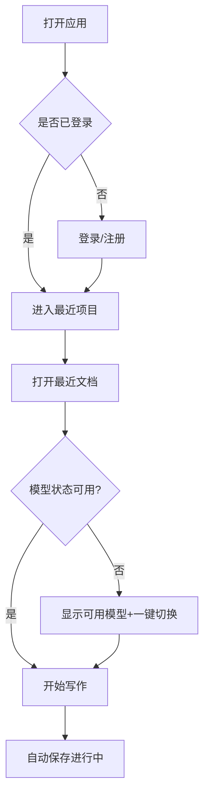
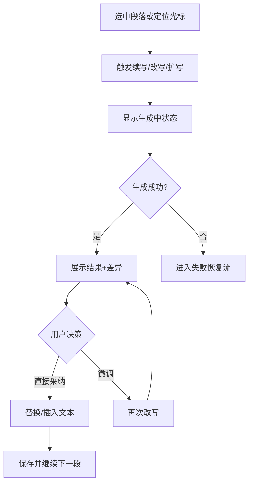
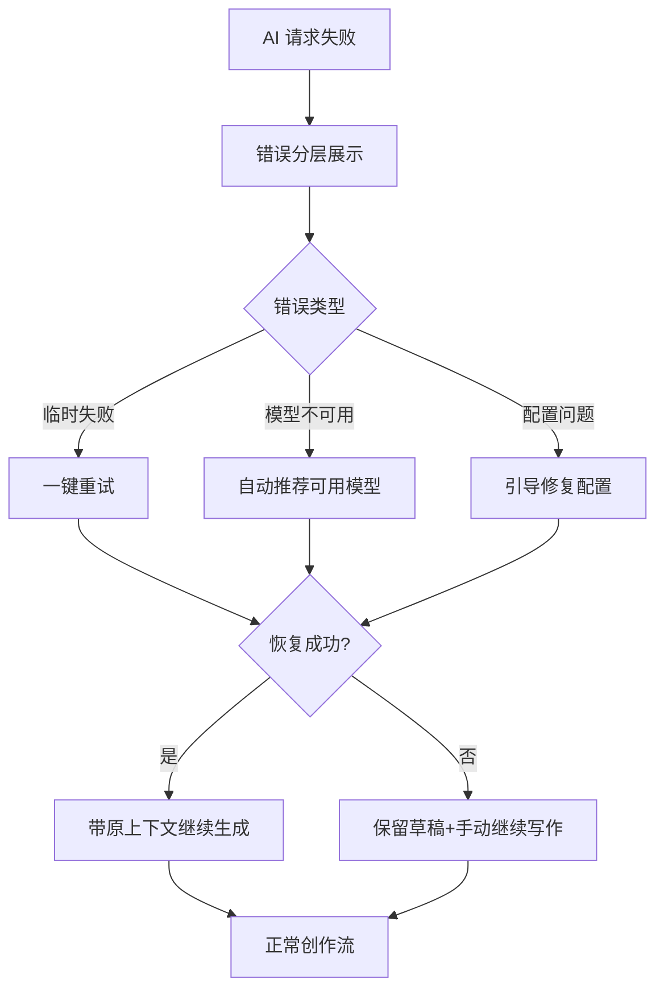

# UX Design Specification writeteam

**Author:** Elij
**Date:** 2026-02-27T16:53:49+08:00

---

<!-- UX design content will be appended sequentially through collaborative workflow steps -->

## Executive Summary

### Project Vision

WriteTeam 的产品愿景是：为中文创作者提供一个低门槛、可持续、可恢复的 AI 写作工作台，让用户在下班后的有限时间内，快速产出高质量且具原创性的内容，并将人工精修时间压缩到最小。
该产品将部署在 Vercel，以 Web 方式服务异地协作用户；每位用户可独立配置自己的 API Key 后直接创作。
从 UX 角度，核心目标不是功能堆叠，而是创作不中断、结果更好、上手更快。

### Target Users

主要用户是 2 位中文创作者（你和异地朋友），共同特征：
- 技术熟练度为小白，不希望处理复杂配置和排障细节
- 平时上班时间长，主要在晚间和碎片时间进行创作
- 需要跨设备使用（电脑与手机），并在不同地点通过同一 Web 应用继续创作
- 期望 AI 充当高效创作助手，先高质量产出，再由人工做少量精修

次要角色需求（由主用户兼任）：
- 轻量运维与排障：当模型不可用时，能快速判断原因并恢复写作
- 配置自治：每位用户独立配置 key，不互相干扰

### Key Design Challenges

1. 多模型接入可用性与兼容性不足
当前体验与 Sudowrite、 类产品存在明显差距：许多模型不可用，且 ChatGPT Plus/Business、Claude Pro 等订阅账户场景无法接入，导致可选模型多但实际可用少的挫败感。

2. 小白用户的配置与故障恢复门槛偏高
用户不应理解协议差异、计费模式和中转格式；界面需要把复杂问题转化为可执行的下一步动作，避免创作被技术问题打断。

3. 跨设备与晚间高压场景下的连续创作体验
用户在疲惫时段使用产品，容错和反馈必须更直接：状态要清晰、操作要短路径、失败要可恢复，否则会直接放弃当晚创作。

### Design Opportunities

1. 打造 5 分钟可开写 的新手导向体验
通过引导式配置、模型健康检查和推荐路径，把首次成功写作时间压缩到极短，建立早期信任。

2. 建立质量优先和原创导向的结果体验
围绕高质量且不通用的目标设计输出控制（风格、一致性、重写策略、原创性提醒），让用户感知到结果差异，而非只看到有输出。

3. 构建失败不掉线的创作保障机制
将错误解释、一键重试、自动回退模型、上下文保留整合为统一交互流，把排障变成继续写作的自然过程，形成与竞品差异化的稳定体验。

## Core User Experience

### Defining Experience

WriteTeam 的核心用户体验是下班后低认知负担创作：用户打开应用后应快速进入写作状态，借助 AI 生成高质量、非模板化文本，并以最少人工介入完成精修与发布准备。
产品价值不在单次生成，而在持续创作循环中的稳定产出效率：每次会话都能顺畅开始、不中断推进、可恢复收尾。
因此，核心体验定义为让小白用户在有限精力与有限时间里，稳定完成想法到成文再到优化的短路径闭环。

### Platform Strategy

平台采用 Web 优先策略，部署在 Vercel，通过统一域名支持异地双用户访问。
设备策略为 Desktop-first + Mobile-usable：桌面端承载主写作流程与深度编辑，手机端保证可继续写作、快速改写、连接检测和故障恢复。
交互模式以鼠标键盘为主、触屏为辅；不要求离线优先，但要求弱网络场景下状态可见、失败可解释、上下文不丢失。

### Effortless Interactions

应做到零思考成本的关键交互包括：
- 快速开写：登录后最短路径进入当前项目与最近文档
- 一键 AI 辅助：改写/续写/扩写触发简单，结果可直接采用或微调
- 失败即恢复：调用失败后自动给出下一步（重试/切换模型/保留上下文继续）
- 配置低负担：API Key、模型、连通性状态可视化，减少试错
- 自动保障：自动保存、上下文延续、跨设备接续尽量无感发生

### Critical Success Moments

决定体验成败的关键时刻：
1. 首次可用时刻：用户首次配置后能否在短时间内产出可用文本
2. 首次质量时刻：用户第一次看到明显比通用输出更好的内容
3. 首次故障时刻：模型失败时能否不崩溃并在几步内恢复创作
4. 连续创作时刻：晚间高疲劳状态下能否持续推进而不被配置和排障打断
5. 跨设备接续时刻：从电脑到手机或反向切换时能否无缝继续

### Experience Principles

1. 创作连续性优先于功能丰富度
2. 小白可用性优先于技术透明度
3. 质量感知优先于输出数量
4. 失败可恢复优先于完美成功假设
5. 配置与排障过程产品化，而非工程化

## Desired Emotional Response

### Primary Emotional Goals

WriteTeam 的首要情绪目标是让用户在有限精力下仍然感到我能写出来，而且写得好。
核心感受应是可控、安心、高效、被启发。
对你们两位用户而言，产品不只是工具，而是晚间副业创作中的稳定搭档，能降低心理负担并提升持续创作信心。

### Emotional Journey Mapping

- 首次发现和进入：应感到门槛不高，我马上能开始
- 配置与连接阶段：应感到步骤清晰、状态透明、问题可处理
- 核心创作阶段：应感到灵感被放大，产出质量有明显提升
- 异常与失败阶段：应感到没有崩盘，我知道下一步怎么恢复
- 回访复用阶段：应感到这是可靠工作台，我愿意继续用它推进作品

### Micro-Emotions

关键微情绪优先级：
1. Confidence over Confusion（知道系统在做什么）
2. Trust over Skepticism（输出质量与稳定性可预期）
3. Accomplishment over Frustration（每次会话都有进展）
4. Calm over Anxiety（失败可恢复，不因技术细节焦虑）
5. Delight over Mere Satisfaction（偶尔出现超预期的创作助力时刻）

### Design Implications

- 可控感：关键状态可见（模型状态、连接结果、失败原因、恢复路径）
- 信任感：结果质量可解释（风格、一致性、原创导向的可调控反馈）
- 安心感：失败后上下文保留 + 一键重试或切换，避免重来
- 成就感：每次会话都强化已完成内容反馈，不让努力无感
- 惊喜感：在不增加操作负担前提下，提供高价值建议和可直接采纳文本

### Emotional Design Principles

1. 先让用户安心，再让用户惊喜
2. 先保证可恢复，再追求高上限
3. 每一步都给出清晰反馈，减少不确定焦虑
4. 让小白用户也能拥有专业创作掌控感
5. 把技术复杂性藏在体验背后，让用户只感知创作价值

## UX Pattern Analysis & Inspiration

### Inspiring Products Analysis

**Sudowrite**
- 优势：围绕创作本身组织功能，写作流连续，AI 工具嵌入场景自然。
- 启发：用户不需要先学系统再开始写，应先写再调优。
- 保留点：高相关写作建议、低打断式交互、连续创作支持。

**OpenRouter（参考为模型供应商体验，不作为写作应用对标）**
- 角色：API 供应商与模型聚合入口，不是完整写作产品。
- 启发：模型层 UX 关键不是数量，而是可用率和预期一致性。
- 保留点：模型能力透明、可用状态清晰、切换成本低。

**ChatGPT / Claude 订阅产品体验（Plus/Business/Pro）**
- 优势：对小白用户来说入口统一、反馈直接、上手成本低。
- 启发：用户更在意立即可用和我看得懂发生了什么，而非技术细节。
- 保留点：简洁输入输出、快速反馈、错误可理解。

### Transferable UX Patterns

**Navigation Patterns**
- 主写作区优先：打开即进入最近项目或文档，减少进入前配置步骤。
- 写作与辅助一体化：AI 工具贴近文本上下文，而非跳转式操作。

**Interaction Patterns**
- 一键触发加可直接采纳：改写、续写、扩写结果可以快速替换或插入。
- 失败恢复短链路：失败后给出下一步动作按钮（重试、换模型、保留上下文继续）。

**Visual Patterns**
- 状态可见：模型可用性、连接状态、失败原因分层展示。
- 反馈分级：普通提示、警告、阻断错误明确区分，避免用户恐慌。

### Anti-Patterns to Avoid

1. 可选模型很多但缺少可用性预判，导致用户频繁踩坑。
2. 错误提示工程化、不可执行（只报错不告诉下一步）。
3. 切换模型或排障流程过长，打断写作心流。
4. 移动端仅能打开，但关键恢复链路不可完成。
5. 把复杂接入差异暴露给小白用户，让用户自己理解协议和计费模式。

### Design Inspiration Strategy

**What to Adopt**
- 采用 Sudowrite 的写作流优先思路，直接服务核心价值持续创作。
- 参考 OpenRouter 的模型可达性体验，但在产品层聚焦可用率与恢复率。

**What to Adapt**
- 将多模型自由选择改造成推荐可用 + 专家模式可选的双层结构，适配小白用户。
- 将订阅账户接入复杂性收敛为产品化引导，不把技术差异直接抛给用户。

**What to Avoid**
- 避免配置优先于创作的流程设计（先折腾再写作）。
- 避免异常后无恢复路径或恢复路径需要跨页面多次尝试。

## Design System Foundation

### 1.1 Design System Choice

选择：Themeable System（基于 Tailwind + shadcn/ui 的主题化设计系统）。

该方案在开发速度、可定制性、长期维护成本之间最平衡，且与当前代码基线一致。
不建议重建全量 Custom Design System（成本过高），也不建议整体迁移到重型现成系统（迁移摩擦和视觉同质化风险高）。

### Rationale for Selection

1. 与现状对齐：项目已使用 Tailwind v4 + shadcn/ui，继续深化可避免重构浪费。
2. 小团队高效率：2 位核心用户 + 小规模开发，优先需要可快速迭代而非体系重造。
3. 体验目标匹配：可用设计 token 与组件变体快速实现低负担、高可恢复的 UX。
4. 跨端兼容友好：Web 主场景下，Tailwind 响应式能力有利于桌面优先、移动可用策略。
5. 可维护性更优：可在既有组件上持续演进，不引入额外重型依赖体系。

### Implementation Approach

- 基线保留：继续以 `src/components/ui/*` 作为基础组件层。
- 分层策略：基础原语（ui） -> 领域组件（editor/ai/settings） -> 页面组合。
- 统一 token：先定义颜色、间距、圆角、字体、阴影、状态语义 token。
- 组件治理：优先统一按钮、输入、反馈、状态提示、空态、错误态规范。
- 交互优先级：先完善写作主链路与故障恢复链路的组件一致性，再扩展次级页面。

### Customization Strategy

- 品牌层：保留中文创作工具的专业与沉浸感，避免通用后台风。
- 体验层：强化状态可见 + 下一步可执行的交互语言（尤其错误与恢复）。
- 可访问层：关键流程对比度、焦点态、键盘可达优先满足。
- 扩展层：新增组件遵循现有 shadcn 模式，不引入并行组件体系。
- 质量层：每次新增或修改组件都需回归桌面与移动关键场景一致性。

## 2. Core User Experience

### 2.1 Defining Experience

WriteTeam 的定义性体验是：用户在下班后打开应用，快速进入当前写作上下文，触发 AI 获得高质量且可直接使用的文本，并在失败时不丢上下文地继续创作。
如果这一个交互被做好，其他体验都会顺滑：配置更简单、写作更稳定、精修更省时。
用户向朋友描述时应是这个工具让我晚上有限时间也能稳定写出能用的内容。

### 2.2 User Mental Model

用户当前心理模型：
- 我想马上写，不想先排障或研究模型协议。
- AI 应该像写作搭档，而不是需要维护的技术系统。
- 失败可以接受，但必须告诉我下一步怎么恢复。

用户对现有方案的认知：
- 喜欢：Sudowrite 的写作流一体化与创作连续感。
- 期望：OpenRouter 级别的模型可达性体验（供应商能力参考，不是写作应用对标）。
- 痛点：当前产品模型接入不稳定、订阅类账号场景不可用、错误不可执行。

### 2.3 Success Criteria

核心交互成功标准：
1. 用户能在短时间内从打开应用进入可写状态并产出可用文本。
2. 用户在调用 AI 时能快速获得结果或明确恢复路径。
3. 用户在异常时不丢上下文，能在少步骤内恢复继续写。
4. 用户主观感受是省时间、质量更高、心智负担更低。
5. 用户愿意在下一次晚间写作时继续使用该流程。

### 2.4 Novel UX Patterns

模式判断：
- 主体采用成熟模式：编辑器 + 上下文内 AI 操作 + 状态反馈。
- 差异化采用组合创新：把可用性探测 + 失败可恢复 + 上下文保留做成写作流原生能力，而非技术附加页。

创新点不是发明全新手势，而是把用户最痛的失败时刻设计成可继续创作的正向路径。

### 2.5 Experience Mechanics

1) Initiation（开始）
- 用户打开应用后优先看到最近项目或文档与当前状态。
- 关键入口清晰：继续写作、快速改写、连接状态检查。

2) Interaction（执行）
- 用户在正文中直接触发 AI 操作（续写、改写、扩写等）。
- 系统即时反馈进度与状态，减少等待焦虑。
- 模型不可用时系统提供替代选项而非中断。

3) Feedback（反馈）
- 成功：结果可直接采纳或微调，状态明确。
- 失败：错误分层可理解，并给出下一步动作按钮。
- 过程：始终可见当前模型状态与可恢复路径。

4) Completion（完成）
- 用户确认文本可用并继续下一段创作。
- 系统自动保存与上下文延续，确保跨设备可接续。
- 用户在会话结束时有明确今日推进已完成的成就感。

## Visual Design Foundation

### Color System

基于参考品牌规范与写作产品场景，采用中性底色 + 温暖强调的配色系统：

- Primary Dark: `#141413`（主文本、深色背景）
- Primary Light: `#faf9f5`（页面底色、深底反白文本）
- Mid Gray: `#b0aea5`（次级文本、分隔信息）
- Light Gray: `#e8e6dc`（弱对比背景、容器层级）

语义强调色：
- Primary Accent (Action): `#d97757`（主按钮、关键引导）
- Secondary Accent (Info): `#6a9bcc`（信息态、链接、辅助操作）
- Tertiary Accent (Success): `#788c5d`（成功态、完成反馈）

语义映射建议：
- success: 以 `#788c5d` 为主
- warning: `#d97757` 的降饱和变体
- error: 在不破坏整体调性的前提下引入独立红色语义 token（与品牌强调色区分）
- info: `#6a9bcc`

可访问性要求：
- 正文与背景对比优先满足 WCAG AA
- 按钮与状态提示在明暗主题下都需保持可识别对比度

### Typography System

依据偏好采用无衬线优先策略，强调长时阅读可读性与界面清晰度：

- Heading/UI Font: `Poppins, Arial, sans-serif`
- Body Font: `Inter, -apple-system, BlinkMacSystemFont, "Segoe UI", Arial, sans-serif`

字阶建议（桌面基线）：
- H1: 32/40, 600
- H2: 24/32, 600
- H3: 20/28, 600
- Body L: 18/28, 400
- Body: 16/24, 400
- Caption: 14/20, 400

排版原则：
- 写作正文区优先可读性（行高约 1.6）
- 控件与导航优先扫描效率（字重与间距更紧凑）
- 避免过多字体混搭，保持认知稳定

### Spacing & Layout Foundation

信息密度采用平衡策略：不是后台式紧凑，也不是展示站式大留白。

间距系统建议：
- 8px 基线网格（4 的倍数可用于微调）
- 常用节奏：4 / 8 / 12 / 16 / 24 / 32 / 48

布局原则：
1. 写作主流程优先：编辑区层级最高，侧栏与工具栏支持但不喧宾夺主。
2. 状态信息就近展示：连接、模型、错误状态尽量贴近操作位置。
3. 渐进披露复杂度：默认简洁，专家能力在需要时展开。

栅格建议：
- Desktop: 12 列，最大内容宽度可控，保障长文本阅读。
- Mobile: 单列优先，关键动作固定可达区域。

### Accessibility Considerations

- 对比度：正文、按钮、状态标签均满足 WCAG AA。
- 键盘可达：核心写作与 AI 触发路径可全键盘完成。
- 焦点可见：统一焦点环与可见反馈，避免当前位置不明确。
- 状态可理解：错误文案必须包含可执行下一步，不仅是技术报错。
- 响应式一致：桌面与移动保持交互语义一致，避免模式切换成本。

## Design Direction Decision

### Design Directions Explored

已探索并可视化 6 个方向（见 `_bmad-output/planning-artifacts/ux-design-directions.html`）：
- D1 编辑器优先
- D2 三栏工作台
- D3 恢复优先流
- D4 轻量移动优先
- D5 极简沉浸
- D6 品质可视化

### Chosen Direction

选择方向：**D3 恢复优先流**。

### Design Rationale

1. 最贴合当前核心痛点：模型可用性不稳定和失败后中断创作。
2. 与核心体验一致：把失败可恢复做成写作主流程原生能力。
3. 对小白用户友好：错误可理解、动作可执行、上下文不丢失。
4. 兼顾质量目标：恢复后继续产出，减少重复操作和精力消耗。

### Implementation Approach

- 在编辑主路径内嵌状态与恢复动作，避免跳转排障页。
- 优先实现失败后三动作：重试、自动切换、继续写作。
- 结果层与状态层并行可见，确保用户始终知道当前系统状态。
- 桌面优先实现完整链路，移动端保证关键恢复操作可达。

## User Journey Flows

### 晚间快速开写（主成功路径）

目标：下班后最短路径进入有效创作。
成功标准：3-5 步内从打开应用到可编辑并开始产出。

### AI 生成并采纳（价值兑现路径）

目标：最少操作获得高质量可用文本。
成功标准：用户能快速发起 AI、评估结果并采纳或微调。

### 失败恢复不断流（差异化关键路径）

目标：失败时不中断创作心流。
成功标准：保留上下文，少步骤恢复并继续写作。

### Journey Patterns

- 入口模式：始终提供继续最近工作短路径入口。
- 决策模式：每个关键节点仅保留 1 个主动作 + 1-2 个次动作。
- 反馈模式：状态先可见，再解释原因，最后给可执行下一步。
- 恢复模式：先保上下文，再恢复能力，最后回主流。

### Flow Optimization Principles

1. 最少步骤到价值（先写再配）。
2. 每一步都可预期（状态、结果、下一步明确）。
3. 失败不丢进度（上下文与草稿优先保留）。
4. 渐进式复杂度（默认简单，专家能力按需展开）。
5. 移动端保障关键闭环（可写、可恢复、可继续）。

## Component Strategy

### Design System Components

基于现有设计系统可直接复用：
- 基础输入与操作：Button, Input, Textarea, Select, Switch, Checkbox
- 结构容器：Card, Tabs, Dialog, Sheet, Popover, Tooltip, ScrollArea
- 状态反馈：Badge, Progress, Sonner(Toaster), AlertDialog
- 导航与布局：Sidebar, Command, Separator, Resizable

这些组件已覆盖通用交互层，可作为所有新能力的基础外壳。

### Custom Components

### ModelHealthPanel
- Purpose: 展示模型可用性与连接健康状态
- Usage: 写作页顶部/侧栏常驻
- States: loading / healthy / degraded / offline
- Actions: 一键测试、切换推荐模型、查看失败原因
- Accessibility: 状态标签 aria-live，操作按钮可键盘触达

### RecoveryActionBar
- Purpose: AI 失败后提供就地恢复动作
- Usage: 生成失败后插入编辑区附近
- States: default / retrying / switched / failed
- Actions: 重试、自动切换、保留上下文继续
- Variants: inline（正文内）/ floating（底部悬浮）

### OutputDiffReview
- Purpose: 对比原文与 AI 结果，支持快速采纳
- Usage: 改写/扩写后出现
- States: preview / accepted / discarded
- Actions: 全量采纳、局部采纳、继续微调
- Accessibility: 语义化 diff 标注，键盘逐段导航

### SessionContinuityBanner
- Purpose: 跨设备或重进页面时恢复会话上下文
- Usage: 页面初始化后按需显示
- States: resume-available / resumed / dismissed
- Actions: 恢复上次上下文、忽略并新开

### Component Implementation Strategy

- 策略：Design System First + Domain Custom Second
- 所有自定义组件基于现有 token 与 shadcn 模式封装，避免并行体系
- 自定义组件优先服务三条关键旅程：快速开写、AI 采纳、失败恢复
- 状态表达统一：成功/警告/失败/处理中语义映射一致
- 所有关键组件都要求键盘可达与可读错误文案

### Implementation Roadmap

Phase 1（核心链路）
1. ModelHealthPanel
2. RecoveryActionBar
3. SessionContinuityBanner

Phase 2（质量与决策）
4. OutputDiffReview
5. AI 操作状态统一（工具条/菜单反馈）

Phase 3（增强体验）
6. 跨端一致性细化（移动端恢复动作优化）
7. 高级可视化反馈（质量提示、建议分级）

## UX Consistency Patterns

### Button Hierarchy

- Primary Button：仅用于当前页面唯一主动作（如继续写作、一键恢复）
- Secondary Button：辅助动作（如切换模型、查看详情）
- Tertiary/Text Button：低优先操作（如稍后处理、了解更多）
- Destructive Button：破坏性操作专用，需二次确认
- 规则：同一视图最多 1 个 Primary；移动端主动作固定可达

### Feedback Patterns

- Success：明确结果 + 下一步建议（例：已恢复，可继续写作）
- Warning：可继续但有风险（例：当前模型不稳定，建议切换）
- Error：分层错误信息（原因 + 可执行动作 + 保留上下文说明）
- Info：非阻断提示（例：已自动保存）
- 规则：所有错误反馈必须包含可执行下一步，不允许只报错

### Form Patterns

- 配置表单采用最少必填 + 高级选项折叠
- 即时校验关键字段（Base URL、Key、Model），错误贴近字段展示
- 提供连接测试并返回可理解结论（成功/失败原因/建议动作）
- 保存策略：显式保存 + 自动保留草稿输入，防止重填
- 规则：小白优先，术语解释就地可见

### Navigation Patterns

- 默认入口：最近项目/最近文档（继续工作优先）
- 主导航稳定：写作、项目、设置三层清晰分区
- 页面内导航：优先保持上下文，不轻易全页跳转
- 恢复导航：失败状态下可一键回主创作流
- 规则：导航变化可预期，避免我现在在哪不明确

### Additional Patterns

**Modal/Overlay**
- 仅用于短决策；长流程改用页面内渐进展开
- 关闭行为一致：Esc、点击遮罩、关闭按钮

**Empty / Loading States**
- Empty：说明当前状态 + 提供第一步动作
- Loading：展示进度或阶段提示，降低等待焦虑

**Search / Filtering（如模型列表）**
- 默认推荐可用项，专家筛选按需展开
- 过滤后状态保留，减少重复操作

## Responsive Design & Accessibility

### Responsive Strategy

**Desktop（1024+）**
- 主工作区优先：编辑区 + 状态/恢复辅助并列呈现
- 利用宽屏展示模型状态、恢复动作、结果对比，降低切换成本
- 保持低打断：辅助信息贴近上下文，不挤占正文焦点

**Tablet（768-1023）**
- 双栏到单栏可切换，优先保证触控可达
- 重要操作（续写/改写/恢复）保持首屏可触达
- 降低信息密度但不牺牲关键状态可见性

**Mobile（320-767）**
- 单列为主，主动作固定在底部可达区
- 写作、AI 操作、失败恢复三件事必须可完整闭环
- 默认隐藏高级配置，按需展开，避免认知过载

### Breakpoint Strategy

采用标准断点并以移动优先实现：
- Mobile: 320-767
- Tablet: 768-1023
- Desktop: 1024+

策略：
- 先定义移动最小可用闭环，再向大屏增强
- 核心操作组件在三个断点保持语义一致
- 仅在信息密度和布局上分层，不改变核心交互逻辑

### Accessibility Strategy

目标等级：**WCAG 2.1 AA**

关键要求：
- 文本对比度达到 AA（正文至少 4.5:1）
- 全键盘可达（写作、AI 触发、恢复动作）
- 清晰焦点可视化与焦点顺序
- 语义化结构与 ARIA（尤其状态提示与错误信息）
- 触控目标最小 44x44
- 错误提示可理解 + 可执行

### Testing Strategy

**Responsive Testing**
- 真机验证：至少 1 台 iOS 手机 + 1 台 Android 手机 + 1 台桌面浏览器组合
- 浏览器覆盖：Chrome / Safari / Edge（必要时 Firefox）
- 慢网场景测试：验证加载、重试、恢复路径

**Accessibility Testing**
- 自动化扫描（如 axe）
- 键盘-only 走通关键流程
- 屏幕阅读器基础检查（状态与错误可读）
- 色觉模拟检查（状态语义不只靠颜色）

**User Testing**
- 以你和朋友为核心样本，围绕晚间 20-30 分钟创作会话做任务测试
- 指标：首次可用时间、失败恢复成功率、单次会话有效推进率

### Implementation Guidelines

- 使用语义化 HTML 与正确 landmark
- 统一焦点样式、统一状态语义 token
- 采用相对单位（rem/%）和移动优先媒体查询
- 错误与状态组件复用统一模式，避免页面间行为不一致
- 每次迭代都做桌面 + 移动 + 键盘最小回归
